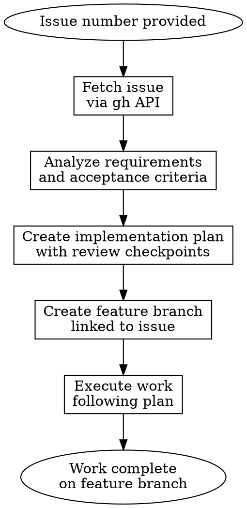

# Develop GitHub Issue

## Overview

Convert a GitHub issue into a complete implementation by viewing the issue details, analyzing requirements, creating a structured implementation plan, establishing an isolated feature branch, and executing the work.

## When to Use

- You have a GitHub issue number to work on
- You need to understand issue requirements before starting
- You want isolated, tracked work on a feature branch
- You want to follow a structured workflow from issue to completion

## Core Workflow



## Step-by-Step Process

### 1. Fetch the Issue
```bash
gh issue view <issue-number>
# Returns: title, body, labels, assignee, state
```

Extract:
- Issue title and description
- Acceptance criteria
- Related labels (bug, feature, enhancement)
- Links to other issues/PRs

### 2. Analyze Requirements

Read the issue and identify:
- **What**: What is being requested?
- **Why**: What problem does this solve?
- **Acceptance Criteria**: How will we know it's done?
- **Scope**: What's in scope, what's not?
- **Dependencies**: Does this depend on other issues?

Ask clarifying questions if requirements are ambiguous.

### 3. Create Implementation Plan

Use `superpowers:writing-plans` to structure the implementation:
- Break down into logical steps
- Identify critical files
- Consider architectural trade-offs
- Plan test strategy
- Identify integration points

Document the plan in conversation context (not a file).

### 4. Create Feature Branch with Issue Number

**CRITICAL: The branch name MUST include the issue number.** This creates a backlink and makes tracking work to issues effortless.

```bash
# Branch naming: <issue-type>/<issue-number>-<kebab-case-description>
# The issue number creates automatic GitHub backlinks to the issue

# Examples:
# - feature/42-add-dark-mode-support
# - fix/123-handle-null-pointer-exception
# - docs/456-update-api-documentation

git checkout -b <branch-name>
```

The issue number in the branch name helps GitHub and humans trace which work belongs to which issue.

### 5. Execute the Work

Follow your implementation plan:
- Work through each step in order
- Test as you go
- Commit with clear, descriptive messages
- **Use `Closes #<issue-number>` in commit messages** — GitHub automatically closes the issue when this commit is merged

```bash
# Example commit that will auto-close issue #42 when merged:
git commit -m "feat: add dark mode toggle component

Closes #42"
```

### 6. Complete Work

When implementation is done:
- Run full test suite
- Create a pull request linked to the issue using `Closes #<issue-number>` in the PR description
- Use `superpowers:requesting-code-review` for review
- Merge when approved — GitHub automatically closes the issue

## Example Usage

**Input:** Issue #42 (Add dark mode support)

**Fetch:**
```
gh issue view 42
```

Returns issue details about adding dark mode.

**Analyze:**
- Feature request to support dark mode theme toggle
- Acceptance: Users can toggle dark/light mode, preference persists
- Scope: UI components + localStorage for preference
- Not in scope: Dark mode colors (use existing design tokens)

**Plan:**
1. Add theme context provider
2. Create useTheme hook
3. Add theme toggle component
4. Update components to use theme context
5. Add localStorage persistence
6. Test theme switching

**Branch:**
```bash
git checkout -b feature/42-add-dark-mode-support
```

The `42` in the branch name creates automatic GitHub backlinks.

**Execute:**
- Implement each step
- Commit with closing keyword:
  ```bash
  git commit -m "feat: add theme context provider

  Closes #42"
  ```
- Test dark/light switching
- Create PR with reference in description:
  ```
  ## Summary
  Implements dark mode toggle with persistent preference storage.

  Closes #42
  ```
- When PR is merged, GitHub automatically closes issue #42

## Common Mistakes

### ❌ Jumping to Code Before Understanding
Starting implementation without analyzing the issue thoroughly. You'll build the wrong thing.

**Fix:** Always spend 5 minutes analyzing requirements first.

### ❌ Creating a Branch Without the Issue Number
Creating a branch like `feature/dark-mode-support` instead of `feature/42-dark-mode-support` breaks GitHub's automatic linking.

**Fix:** Always include the issue number in the branch name: `type/issue-number-description`.

### ❌ Not Using "Closes" Keyword in Commits
Using `git commit -m "feat: stuff"` instead of including `Closes #42` means the issue won't auto-close when merged.

**Fix:** Always use `Closes #<issue-number>` in commit messages. GitHub recognizes these keywords:
- `Closes #N`
- `Fixes #N`
- `Resolves #N`

When merged, the issue automatically closes.

### ❌ Skipping the Plan Step
Jumping into implementation without a plan leads to refactoring and false starts.

**Fix:** Use `superpowers:writing-plans` to create a structured plan before implementing.

### ❌ Not Linking PR to Issue
Creating a PR without linking to the original issue loses the context and prevents automatic issue closure.

**Fix:** Reference the issue in the PR description using `Closes #42` so the issue auto-closes when PR is merged.

## Quick Reference

| Step | Tool | Output | GitHub Linking |
|------|------|--------|---|
| Fetch Issue | `gh issue view #N` | Issue details | - |
| Analyze | Read carefully | Requirements list | - |
| Plan | `superpowers:writing-plans` | Implementation steps | - |
| Branch | `git checkout -b type/N-desc` | Local feature branch | ✓ Issue #N in name |
| Execute | Code implementation | Working code on branch | Commit: "Closes #N" |
| Review | `superpowers:requesting-code-review` | Reviewed work | PR description: "Closes #N" |
| Complete | Merge to main | Issue auto-closes | ✓ GitHub closes issue |

## Integration with Other Skills

**REQUIRED:** Use `superpowers:writing-plans` when creating your implementation plan

**Recommended:** Use `superpowers:test-driven-development` when implementing features

**Recommended:** Use `superpowers:verification-before-completion` before marking work done

## Red Flags - Things That Mean You're Skipping Steps

- Branching before analyzing the issue → You don't understand requirements yet
- Creating a branch without the issue number → GitHub linking broken, backlinks won't work
- Implementing without a plan → You'll refactor multiple times
- Committing without `Closes #N` keyword → Issue won't auto-close, traceability lost
- Creating PR without `Closes #N` in description → Issue won't auto-close
- Merging without review → Bypasses quality gate

**All of these mean: Stop. Go back to the previous step.**

**CRITICAL:** The issue number must appear in BOTH the branch name AND in commit/PR messages using "Closes #N" to ensure automatic linking and closure.
