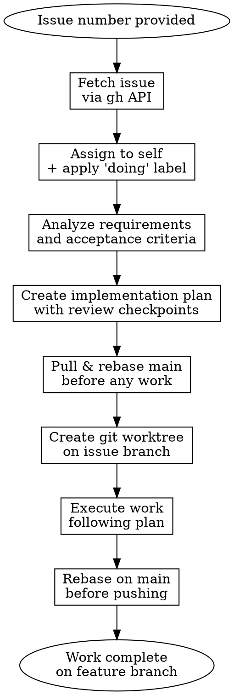

# Develop GitHub Issue

## Overview

Convert a GitHub issue into a complete implementation by viewing the issue details, analyzing requirements, creating a structured implementation plan, establishing an isolated feature branch, and executing the work.

## When to Use

- You have a GitHub issue number to work on
- You need to understand issue requirements before starting
- You want isolated, tracked work on a feature branch
- You want to follow a structured workflow from issue to completion

## Core Workflow



## Step-by-Step Process

### 1. Fetch the Issue
```bash
gh issue view <issue-number>
# Returns: title, body, labels, assignee, state
```

Extract:
- Issue title and description
- Acceptance criteria
- Related labels (bug, feature, enhancement)
- Links to other issues/PRs

### 2. Claim the Issue

Before analyzing, signal that work is actively in progress.

```bash
# Assign the issue to yourself
gh issue edit <issue-number> --add-assignee @me

# Apply the "doing" label (create it if it doesn't exist)
gh label create "doing" --color "0075ca" --description "Actively being worked on" 2>/dev/null || true
gh issue edit <issue-number> --add-label "doing"
```

This makes in-flight work visible to the whole team in the issue tracker.

### 3. Analyze Requirements

Read the issue and identify:
- **What**: What is being requested?
- **Why**: What problem does this solve?
- **Acceptance Criteria**: How will we know it's done?
- **Scope**: What's in scope, what's not?
- **Dependencies**: Does this depend on other issues?

Ask clarifying questions if requirements are ambiguous.

### 4. Create Implementation Plan

Use `superpowers:writing-plans` to structure the implementation:
- Break down into logical steps
- Identify critical files
- Consider architectural trade-offs
- Plan test strategy
- Identify integration points

Document the plan in conversation context (not a file).

### 5. Sync Main Before Creating the Worktree

**ALWAYS pull and rebase main before creating a worktree.** Starting from a stale base means your branch will immediately diverge and you'll face larger conflicts later.

```bash
# From the main repo checkout (not a worktree)
git checkout main
git pull --rebase origin main
```

Only create the worktree once main is up to date. This ensures your feature branch starts from the latest commit.

### 6. Create Git Worktree with Issue Branch

**CRITICAL: The branch name MUST include the issue number.** This creates a backlink and makes tracking work to issues effortless. Use a **git worktree** so multiple issues can be worked on concurrently without switching branches in your main checkout.

Use `superpowers:using-git-worktrees` to create the worktree. It handles directory placement, branch creation, and safety verification for you.

```bash
# Branch naming: <issue-type>/<issue-number>-<kebab-case-description>
# Examples:
# - feature/42-add-dark-mode-support
# - fix/123-handle-null-pointer-exception
# - docs/456-update-api-documentation

# Worktree is created alongside the main repo (e.g., ../repo-wt-42/)
git worktree add ../$(basename $(pwd))-wt-<issue-number> -b <branch-name>
```

The worktree gives you a separate working directory on its own branch — your main checkout stays on whatever branch it was on. Multiple worktrees = multiple issues in flight simultaneously.

### 7. Execute the Work

Follow your implementation plan:
- Work through each step in order
- Test as you go
- Commit with clear, descriptive messages
- **Use `Closes #<issue-number>` in commit messages** — GitHub automatically closes the issue when this commit is merged

```bash
# Example commit that will auto-close issue #42 when merged:
git commit -m "feat: add dark mode toggle component

Closes #42"
```

### 8. Rebase on Main Before Pushing

**Before pushing your feature branch, rebase on the latest main to incorporate any changes that landed while you were working.** Resolve conflicts locally so the PR is clean.

```bash
# From inside the worktree
git fetch origin
git rebase origin/main

# If conflicts arise, for each conflicted file:
#   1. Open file and resolve conflict markers (<<<<, ====, >>>>)
#   2. git add <resolved-file>
#   3. git rebase --continue
# To abort and start over: git rebase --abort
```

Once the rebase is clean, push and open the PR.

### 9. Complete Work

When implementation is done:
- Run full test suite
- Create a pull request, mirroring the issue's metadata:
  - Use `Closes #<issue-number>` in the PR description
  - Assign the PR to the same person the issue is assigned to
  - Apply the same labels the issue has (minus "doing")

```bash
# Capture issue metadata
ASSIGNEE=$(gh issue view <issue-number> --json assignees --jq '.assignees[0].login')
LABELS=$(gh issue view <issue-number> --json labels --jq '[.labels[].name | select(. != "doing")] | join(",")')

# Create PR with matching assignee and labels
gh pr create \
  --title "<title>" \
  --body "$(printf 'Closes #<issue-number>')" \
  --assignee "$ASSIGNEE" \
  --label "$LABELS"
```

- Use `superpowers:requesting-code-review` for review
- Merge when approved — GitHub automatically closes the issue
- After merging, swap the "doing" label for "completed" on the issue:

```bash
gh label create "completed" --color "0e8a16" --description "Work merged and complete" 2>/dev/null || true
gh issue edit <issue-number> --remove-label "doing" --add-label "completed"
```

## Example Usage

**Input:** Issue #42 (Add dark mode support)

**Fetch:**
```
gh issue view 42
```

Returns issue details about adding dark mode.

**Analyze:**
- Feature request to support dark mode theme toggle
- Acceptance: Users can toggle dark/light mode, preference persists
- Scope: UI components + localStorage for preference
- Not in scope: Dark mode colors (use existing design tokens)

**Plan:**
1. Add theme context provider
2. Create useTheme hook
3. Add theme toggle component
4. Update components to use theme context
5. Add localStorage persistence
6. Test theme switching

**Worktree:**
```bash
git worktree add ../destiny-gun-roulette-wt-42 -b feature/42-add-dark-mode-support
cd ../destiny-gun-roulette-wt-42
```

The `42` in the branch name creates automatic GitHub backlinks. The worktree keeps your main checkout untouched.

**Execute:**
- Implement each step
- Commit with closing keyword:
  ```bash
  git commit -m "feat: add theme context provider

  Closes #42"
  ```
- Test dark/light switching
- Create PR with reference in description:
  ```
  ## Summary
  Implements dark mode toggle with persistent preference storage.

  Closes #42
  ```
- When PR is merged, GitHub automatically closes issue #42

## Common Mistakes

### ❌ Jumping to Code Before Understanding
Starting implementation without analyzing the issue thoroughly. You'll build the wrong thing.

**Fix:** Always spend 5 minutes analyzing requirements first.

### ❌ Using `git checkout -b` Instead of a Worktree
Switching branches in your main checkout blocks you from working on other issues concurrently and discards in-progress work.

**Fix:** Use `git worktree add` (via `superpowers:using-git-worktrees`) to get an isolated directory per issue.

### ❌ Creating a Branch Without the Issue Number
Creating a branch like `feature/dark-mode-support` instead of `feature/42-dark-mode-support` breaks GitHub's automatic linking.

**Fix:** Always include the issue number in the branch name: `type/issue-number-description`.

### ❌ Not Using "Closes" Keyword in Commits
Using `git commit -m "feat: stuff"` instead of including `Closes #42` means the issue won't auto-close when merged.

**Fix:** Always use `Closes #<issue-number>` in commit messages. GitHub recognizes these keywords:
- `Closes #N`
- `Fixes #N`
- `Resolves #N`

When merged, the issue automatically closes.

### ❌ Skipping the Plan Step
Jumping into implementation without a plan leads to refactoring and false starts.

**Fix:** Use `superpowers:writing-plans` to create a structured plan before implementing.

### ❌ Not Linking PR to Issue
Creating a PR without linking to the original issue loses the context and prevents automatic issue closure.

**Fix:** Reference the issue in the PR description using `Closes #42` so the issue auto-closes when PR is merged.

## Quick Reference

| Step | Tool | Output | GitHub Linking |
|------|------|--------|---|
| Fetch Issue | `gh issue view #N` | Issue details | - |
| Claim | `gh issue edit` | Assigned to self + "doing" label | ✓ Visible in issue tracker |
| Analyze | Read carefully | Requirements list | - |
| Plan | `superpowers:writing-plans` | Implementation steps | - |
| Sync main | `git pull --rebase origin main` | Up-to-date base | - |
| Worktree | `git worktree add ../repo-wt-N -b type/N-desc` | Isolated worktree dir | ✓ Issue #N in name |
| Execute | Code implementation | Working code on branch | Commit: "Closes #N" |
| Rebase | `git fetch origin && git rebase origin/main` | Conflict-free branch | - |
| Review | `superpowers:requesting-code-review` | Reviewed work | PR description: "Closes #N" |
| Complete | `gh pr create` with matching assignee + labels | Issue auto-closes | ✓ GitHub closes issue |

## Integration with Other Skills

**REQUIRED:** Use `superpowers:using-git-worktrees` when creating the worktree for the issue branch

**REQUIRED:** Use `superpowers:writing-plans` when creating your implementation plan

**Recommended:** Use `superpowers:test-driven-development` when implementing features

**Recommended:** Use `superpowers:verification-before-completion` before marking work done

## Red Flags - Things That Mean You're Skipping Steps

- Branching before analyzing the issue → You don't understand requirements yet
- Creating a worktree without pulling main first → Branch starts from a stale base, bigger conflicts later
- Using `git checkout -b` in main checkout → Blocks concurrent issue work; use `git worktree add` instead
- Creating a branch without the issue number → GitHub linking broken, backlinks won't work
- Implementing without a plan → You'll refactor multiple times
- Committing without `Closes #N` keyword → Issue won't auto-close, traceability lost
- Creating PR without `Closes #N` in description → Issue won't auto-close
- Pushing without rebasing on main first → PR will have unnecessary merge conflicts or stale code
- Merging without review → Bypasses quality gate

**All of these mean: Stop. Go back to the previous step.**

**CRITICAL:** The issue number must appear in BOTH the branch name AND in commit/PR messages using "Closes #N" to ensure automatic linking and closure.
